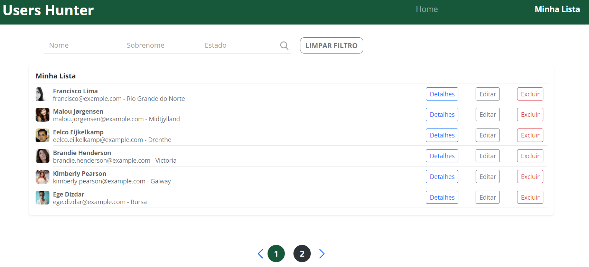
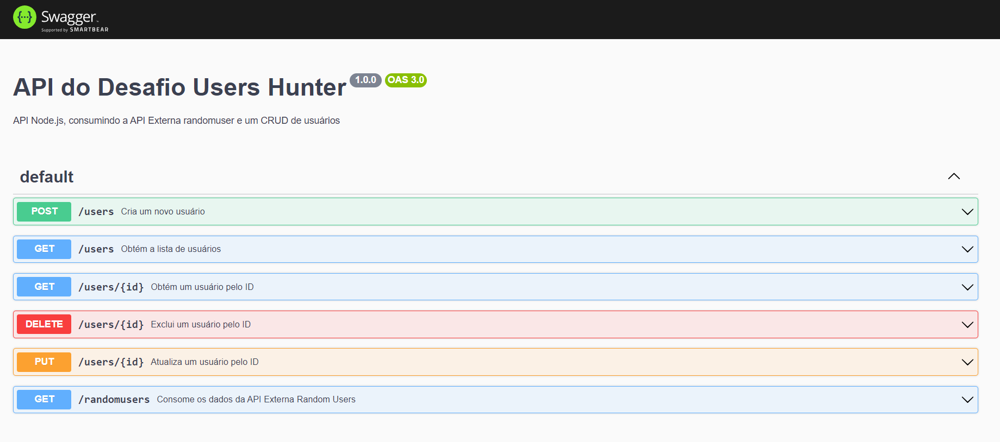

# Users Hunter 📑

## Sobre o Projeto📖

Este projeto é um desafio de Desenvolvimento FullStack utilizando as tecnologias Node.js no backend e React no frontend. O objetivo deste desafio é consumir dados da API randomusers.me, realizar o tratamento desses dados por meio de filtros específicos e criar um novo endpoint com os dados filtrados. Além disso, é necessário implementar um CRUD de usuários que permita a manipulação desses dados, bem como a realização de buscas paginadas e a aplicação de filtros por nome, sobrenome e estado, tanto no backend quanto no frontend.

### Ferramentas 🛠

- HTML
- Sass
- Bootstrap
- TypeScript
- Node
- TypeORM
- Swagger
- React
- Docker
- PostgreSQL

API Endpoints
Para fazer as requisições HTTP abaixo, foi utilizada a ferramenta <a href="https://insomnia.rest/download" target="_blank">Insomnia</a>:

